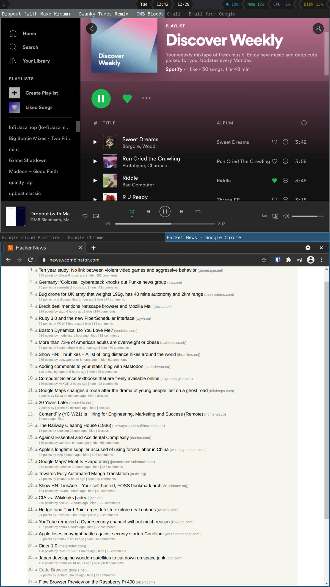

# Linux Config


This repo contains some scripts to configure a new Linux system. Only fully tested on Arch Linux, but it should be able to at least install the dotfiles on other systems (including headless servers).

Usage:

```
cd ~
git clone https://github.com/gartnera/.linux-config
./.linux-config/configure.sh
```

Things you'd need to do:

- Install the system
- Graphics drivers/mesa/vaapi
- Select which chrome(ium) to use

# File Overview

## configure.sh

Sets some environment variables (`LINUXCONFIG_*`) used by the rest of the config. Installs required packages.

## configure-parts

Modular configuration scripts which each do one thing. Executed at the end of `configure.sh` by the `run-parts` command. You could disable a module by running `chmod -x 10-module`. `run-parts` executes in ascending order (10, 20, 30).

## dotfiles

### links

These files are directly symlinked into the home directory.

### copies

These files are copied into the home directory only if they don't already exist.

## files

Miscellaneous files that are referenced/linked by another script.

## scripts-bin

Scripts that I use on my system frequently. Prepended to `$PATH` so that we can override badly behaved system tools.

Note that I also configure `${HOME}/bin` in the `$PATH`, this is where you should put binaries you download.

## system-configs

These configs are copied directly into the root (`/`) directory. Variables in file/directory paths and file contents are interpolated (see `configure-parts/60-systemconfig`)

## utils

Miscellaneous bash functions that can be `source`'d. Mainly for internal use in this repo, but could be useful elsewhere. Not in `$PATH`. 

# Customization

There are a few things hardcoded in the config (like git author name). If you want to update with any changes I make later, you'd either need to `git stash`, `git pull`, `git stash pop`. Alternatively commit your changes, then `git fetch origin` + `git rebase origin/main`. Committing your changes is a good idea if you want to run the same config on multiple systems.

Maybe you like some parts of the config but not others. You could still `git cherry-pick` individual changes onto your fork. In the following example, `origin` is your fork's remote name and `upstream` is this repo's remote name (`git remote add upstream ...`)

- Get upstream history: `git fetch upstream`
- Look through changelog to find commit: `git log upstream/main`
    - You could also specify one file/directory as an argument: `git log upstream/main -- configure-parts`
- `git cherry-pick <commit>`

# Other Notes

## chrome

The `chrome` (in `scripts-bin`) has some workarounds for wayland. It should be synonymous to calling `chromium` directly. You should probably look at it.

The `capp` or `chrome-app` commands opens the first argument (`$1`) as a full screen app (`--app="$1"`). This displays the webpage without any tabs/borders (nice when using a tiling window manager). I also have helper scripts (`gmail`, `gcal`, `slack`, `spt-web`) to open some pages I use frequently in app mode. I then set sway to use tabs for these pages. Here's an example of what this looks like in practice:



I have a vertical split of two tabbed layouts. The top tabbed layout has app mode chrome windows, the bottom layout tabbed layout has normal chrome windows. Each chrome window on the bottom is reserved for a specific purpose. At work, I usually have three chrome windows here:

- GCP console, internal tools, status pages
- Internal reference, code, tickets
- External reference

The [vimium chrome extension](http://vimium.github.io/) works well in combination with the vim style navigation in sway.

I use `code-server` (aur) as my code editor (vscode in browser) . The `code-server` script will start a `code-server` instance in the current directory and also launch chrome in app mode pointed at it. I also could ssh tunnel to `code-server` instances on remote servers.

## spotify/spotfiyd

[spotifyd](https://github.com/Spotifyd/spotifyd) hasn't worked well for me recently, so I'm just using the spotify web player (`spt-web` command). The native Spotify app has never worked well for me.

## NVIDIA

On my desktop, I have a NVIDIA GPU. I want to be able to use sway like I do on my work computer, but also be able to run CUDA/games occasionally. This requires being able to select wether I want `nouveau` or the proprietary `nvidia` driver at boot. Here's how I accomplish this:

- Install `linux-headers linux-firmware nvidia-dkms`
- Remove/truncate all `nvidia` modprobe blacklist files (`rm /usr/lib/modprobe.d/nvidia-dkms.conf`)
- Set this in `/etc/mkinitcpio.conf`:

```
MODULES=(nouveau nvidia nvidia_modeset nvidia_uvm nvidia_drm)
```

- Modify your `/etc/default/grub` to look like this (ensuring options to boot nvidia are only in `LINUX_DEFAULT` and not in `LINUX`):

```
GRUB_CMDLINE_LINUX_DEFAULT="modprobe.blacklist=nouveau nvidia-drm.modeset=1"
GRUB_CMDLINE_LINUX="cryptdevice=UUID=dfca0639-da7c-49bf-953e-40bddd11bc83:cryptroot"
```

- Find the following lines in `/etc/grub.d/10_linux`:

```
linux_entry "${OS}" "${version}" advanced \
            "${GRUB_CMDLINE_LINUX} ${GRUB_CMDLINE_LINUX_DEFAULT}"
```

- Make a copy of those lines and make the following change (note how we leave off `${GRUB_CMDLINE_LINUX_DEFAULT}` which contains the `nvidia` options):

```
linux_entry "${OS}" "${version}-nouveau" nouveau \
            "${GRUB_CMDLINE_LINUX}"
```

- Result should look like this:

```
linux_entry "${OS}" "${version}" advanced \
            "${GRUB_CMDLINE_LINUX} ${GRUB_CMDLINE_LINUX_DEFAULT}"

linux_entry "${OS}" "${version}-nouveau" nouveau \
            "${GRUB_CMDLINE_LINUX}"
```

- run `grub-mkconfig -o /boot/grub/grub.cfg` and `mkinitcpio -P`
- comment out `DRIVER=="nvidia", RUN+="/usr/lib/gdm-disable-wayland"` in `/usr/lib/udev/rules.d/61-gdm.rules` if you want to allow running wayland with the `nvidia` driver
- reboot and select `nouveau` option in advanced when booting

At the time of writing, `chromium` doesn't work under nouveau + sway but `google-chrome-dev` (aur) does.