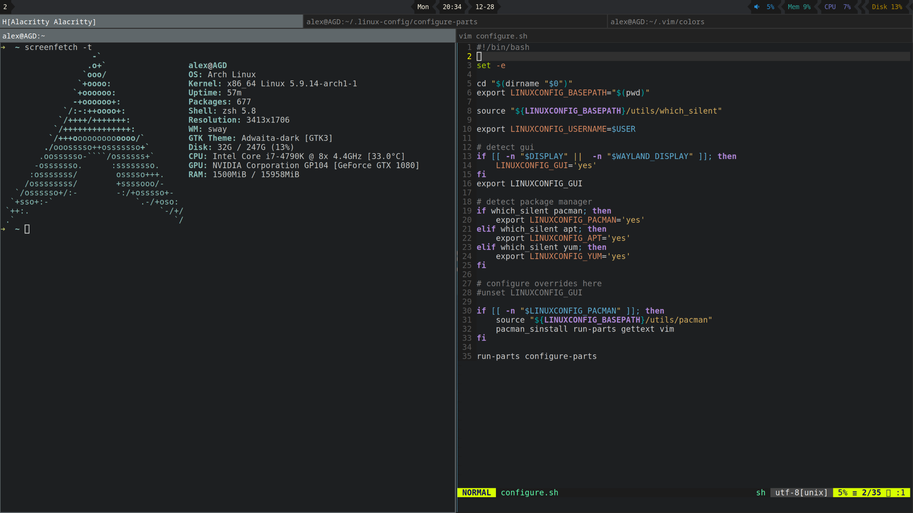

# Linux Config



This repo contains some scripts to configure a new Linux system. Only fully tested on Arch Linux, but it should be able to at least install the dotfiles on other systems (including headless servers).

Usage:

```
cd ~
git clone https://github.com/gartnera/.linux-config
./.linux-config/configure.sh
```

Things you'd need to do:

- Install the system
- Graphics drivers/mesa/vaapi
- Select which chrome(ium) to use
